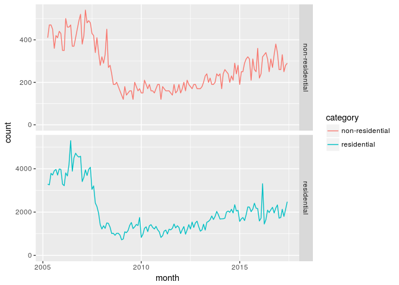

# Reproducing the plots
Alastair Currie  
15 August 2017  

#Reproducing the plots

```r
library('readxl')
library('kableExtra')
library('lubridate')
```

```
## 
## Attaching package: 'lubridate'
```

```
## The following object is masked from 'package:base':
## 
##     date
```

```r
library('tidyverse')
```

```
## Loading tidyverse: ggplot2
## Loading tidyverse: tibble
## Loading tidyverse: tidyr
## Loading tidyverse: readr
## Loading tidyverse: purrr
## Loading tidyverse: dplyr
```

```
## Conflicts with tidy packages ----------------------------------------------
```

```
## as.difftime(): lubridate, base
## date():        lubridate, base
## filter():      dplyr, stats
## intersect():   lubridate, base
## lag():         dplyr, stats
## setdiff():     lubridate, base
## union():       lubridate, base
```

```r
resCountRaw <- read_xlsx('./UK_Tables_Jul_2017_monthlies.xlsx','Residential')
nonresCountRaw <- read_xlsx('./UK_Tables_Jul_2017_monthlies.xlsx','Non-residential')

resCount <- resCountRaw %>%
            gather('area','count',2:7) %>%
            mutate(category='residential')
            
nonresCount <- nonresCountRaw %>%
               gather('area','count',2:7) %>% 
               mutate(category='non-residential')

monthlyCount <- dplyr::union(resCount,nonresCount) %>%
                mutate(
                  year=strftime(month,format='%Y'),
                  fyst=year(month)-as.integer( month(month)<4 ),
                  fy=paste0(as.character(fyst),'\U2013',as.character((fyst+1) %% 100)),
                  quarter=quarters(month)
                )

thisMonth <- ymd('2017-07-01',tz='UTC')
recentRangeStart <- thisMonth %m+% months(-17)
historicRangeStart <- ymd('2005-04-01',tz='UTC')
recentMonths <- seq(recentRangeStart,thisMonth,by='month')
historicMonths <- seq(historicRangeStart,thisMonth,by='month')

monthlyCount %>% 
  filter(area %in% c('UK','UKSeasonallyAdjusted')) %>%
  filter(month %in% recentMonths) %>%
  filter(category == 'residential') %>%
  ggplot(mapping = aes(x=month,y=count,colour=area)) +
  expand_limits(y=0) +
  geom_line() -> chart1a
plot(chart1a)
```

<!-- -->

```r
monthlyCount %>% 
  filter(area %in% c('UK','UKSeasonallyAdjusted')) %>%
  filter(month %in% recentMonths) %>%
  filter(category == 'non-residential') %>%
  ggplot(mapping = aes(x=month,y=count,colour=area)) +
  expand_limits(y=0) +
  geom_line() -> chart1b
plot(chart1b)
```

<!-- -->

```r
monthlyCount %>% 
  filter(area %in% c('UK','UKSeasonallyAdjusted')) %>%
  filter(month %in% historicMonths) %>%
  filter(category == 'residential') %>%
  ggplot(mapping = aes(x=month,y=count,colour=area)) +
  expand_limits(y=0) +
  geom_line() -> chart4a
plot(chart4a)
```

<!-- -->

```r
monthlyCount %>% 
  filter(area %in% c('UK','UKSeasonallyAdjusted')) %>%
  filter(month %in% historicMonths) %>%
  filter(category == 'non-residential') %>%
  ggplot(mapping = aes(x=month,y=count,colour=area)) +
  expand_limits(y=0) +
  geom_line() -> chart4b
plot(chart4b)
```

<!-- -->

```r
monthlyCount %>% 
  filter(area == 'England') %>%
  filter(month %in% historicMonths) %>%
  ggplot(mapping = aes(x=month,y=count,colour=category)) +
  facet_grid(category ~ ., scales="free_y" )+
  expand_limits(y=0) +
  geom_line() -> chart4c
plot(chart4c) # TODO dual y-axes, see http://lehoangvan.com/posts/dual-y-axis-ggplot2/
```

<!-- -->

```r
monthlyCount %>% 
  filter(area == 'Scotland') %>%
  filter(month %in% historicMonths) %>%
  ggplot(mapping = aes(x=month,y=count,colour=category)) +
  facet_grid(category ~ ., scales="free_y" )+
  expand_limits(y=0) +
  geom_line() -> chart4d
plot(chart4d)
```

<!-- -->

```r
monthlyCount %>% 
  filter(area == 'Wales') %>%
  filter(month %in% historicMonths) %>%
  ggplot(mapping = aes(x=month,y=count,colour=category)) +
  facet_grid(category ~ ., scales="free_y" )+
  expand_limits(y=0) +
  geom_line() -> chart4e
plot(chart4e) # TODO dual y-axes, see http://lehoangvan.com/posts/dual-y-axis-ggplot2/
```

<!-- -->

```r
monthlyCount %>% 
  filter(area == 'Northern Ireland') %>%
  filter(month %in% historicMonths) %>%
  ggplot(mapping = aes(x=month,y=count,colour=category)) +
  facet_grid(category ~ ., scales="free_y" )+
  expand_limits(y=0) +
  geom_line() -> chart4f
plot(chart4f)
```

<!-- -->

#Reproducing the tables
 Table 2
 

```r
 knitr::kable(monthlyCount %>% filter(month %in% recentMonths, category == 'residential') %>% select (-c(category,year,fyst,fy,quarter)) %>% spread(area,count))
```


month         England   Northern Ireland   Scotland       UK   UKSeasonallyAdjusted   Wales
-----------  --------  -----------------  ---------  -------  ---------------------  ------
2016-02-01      80110               1720       5670    91310                 105990    3810
2016-03-01     149710               3310      11330   171370                 170230    7020
2016-04-01      62150               1450       6760    73560                  81240    3200
2016-05-01      70490               1650       7260    83000                  87560    3600
2016-06-01      86860               2090       8860   102130                  95920    4320
2016-07-01      90220               1980       9300   106040                  97220    4540
2016-08-01      92650               2110       8640   108100                  97460    4700
2016-09-01      89100               2220       9490   105370                  96420    4560
2016-10-01      83250               1960       8440    98050                  96740    4400
2016-11-01      86920               2190       8710   102430                  97300    4610
2016-12-01      93540               2330       8560   109570                  98670    5140
2017-01-01      69090               1720       6400    80680                 102720    3470
2017-02-01      72360               1750       5860    83630                 101000    3660
2017-03-01      88780               2130       9320   105550                 102940    5320
2017-04-01      73900               1800       8030    87720                 102090    3990
2017-05-01      82480               2120       8700    97830                 100270    4530
2017-06-01      92910               2480      10340   110750                  96910    5020
