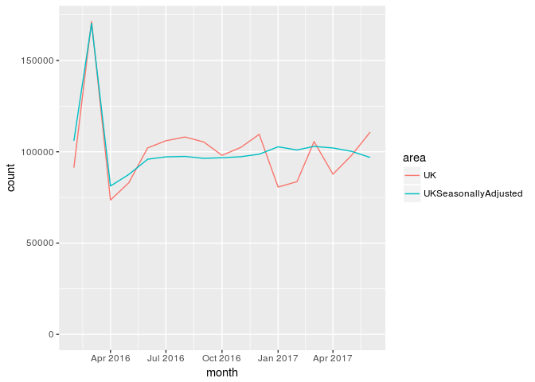
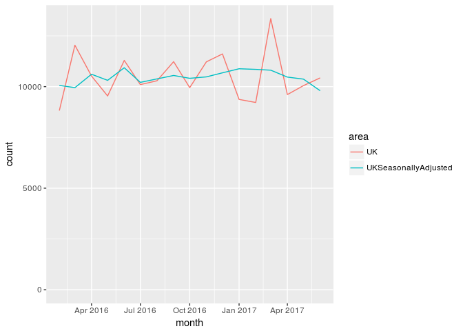
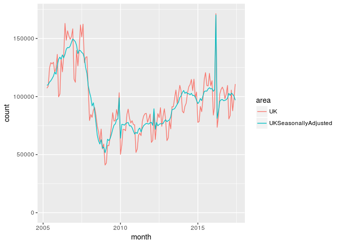
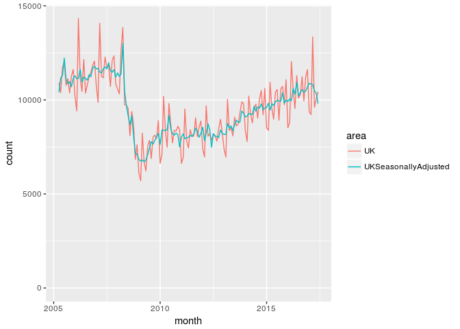
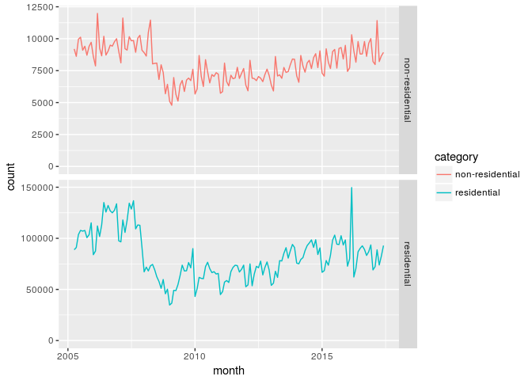
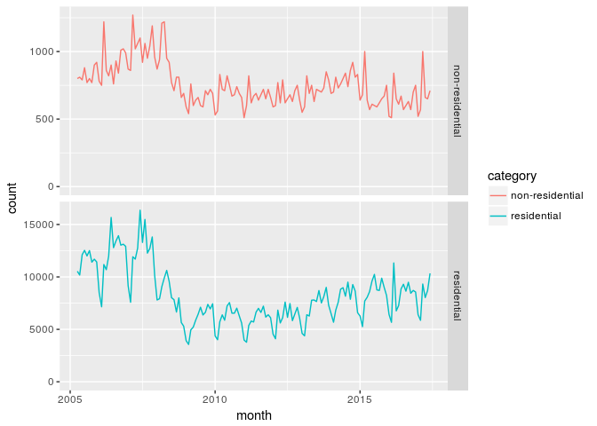
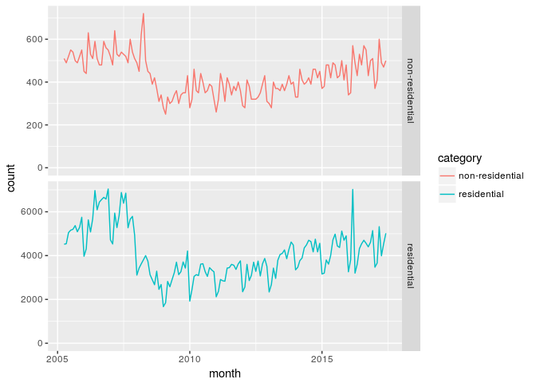
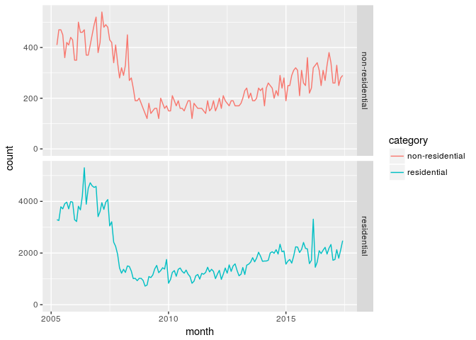

Reproducing the plots
=====================

    library('readxl')
    library('kableExtra')
    library('lubridate')

    ## 
    ## Attaching package: 'lubridate'

    ## The following object is masked from 'package:base':
    ## 
    ##     date

    library('tidyverse')

    ## Loading tidyverse: ggplot2
    ## Loading tidyverse: tibble
    ## Loading tidyverse: tidyr
    ## Loading tidyverse: readr
    ## Loading tidyverse: purrr
    ## Loading tidyverse: dplyr

    ## Conflicts with tidy packages ----------------------------------------------

    ## as.difftime(): lubridate, base
    ## date():        lubridate, base
    ## filter():      dplyr, stats
    ## intersect():   lubridate, base
    ## lag():         dplyr, stats
    ## setdiff():     lubridate, base
    ## union():       lubridate, base

    resCountRaw <- read_xlsx('./UK_Tables_Jul_2017_monthlies.xlsx','Residential')
    nonresCountRaw <- read_xlsx('./UK_Tables_Jul_2017_monthlies.xlsx','Non-residential')

    resCount <- resCountRaw %>%
                gather('area','count',2:7) %>%
                mutate(category='residential')
                
    nonresCount <- nonresCountRaw %>%
                   gather('area','count',2:7) %>% 
                   mutate(category='non-residential')

    monthlyCount <- dplyr::union(resCount,nonresCount) %>%
                    mutate(
                      year=strftime(month,format='%Y'),
                      fyst=year(month)-as.integer( month(month)<4 ),
                      fy=paste0(as.character(fyst),'\U2013',as.character((fyst+1) %% 100)),
                      quarter=quarters(month)
                    )

    thisMonth <- ymd('2017-07-01',tz='UTC')
    recentRangeStart <- thisMonth %m+% months(-17)
    historicRangeStart <- ymd('2005-04-01',tz='UTC')
    recentMonths <- seq(recentRangeStart,thisMonth,by='month')
    historicMonths <- seq(historicRangeStart,thisMonth,by='month')

    monthlyCount %>% 
      filter(area %in% c('UK','UKSeasonallyAdjusted')) %>%
      filter(month %in% recentMonths) %>%
      filter(category == 'residential') %>%
      ggplot(mapping = aes(x=month,y=count,colour=area)) +
      expand_limits(y=0) +
      geom_line() -> chart1a
    plot(chart1a)

    monthlyCount %>% 
      filter(area %in% c('UK','UKSeasonallyAdjusted')) %>%
      filter(month %in% recentMonths) %>%
      filter(category == 'non-residential') %>%
      ggplot(mapping = aes(x=month,y=count,colour=area)) +
      expand_limits(y=0) +
      geom_line() -> chart1b
    plot(chart1b)

    monthlyCount %>% 
      filter(area %in% c('UK','UKSeasonallyAdjusted')) %>%
      filter(month %in% historicMonths) %>%
      filter(category == 'residential') %>%
      ggplot(mapping = aes(x=month,y=count,colour=area)) +
      expand_limits(y=0) +
      geom_line() -> chart4a
    plot(chart4a)

    monthlyCount %>% 
      filter(area %in% c('UK','UKSeasonallyAdjusted')) %>%
      filter(month %in% historicMonths) %>%
      filter(category == 'non-residential') %>%
      ggplot(mapping = aes(x=month,y=count,colour=area)) +
      expand_limits(y=0) +
      geom_line() -> chart4b
    plot(chart4b)

    monthlyCount %>% 
      filter(area == 'England') %>%
      filter(month %in% historicMonths) %>%
      ggplot(mapping = aes(x=month,y=count,colour=category)) +
      facet_grid(category ~ ., scales="free_y" )+
      expand_limits(y=0) +
      geom_line() -> chart4c
    plot(chart4c) # TODO dual y-axes, see http://lehoangvan.com/posts/dual-y-axis-ggplot2/

    monthlyCount %>% 
      filter(area == 'Scotland') %>%
      filter(month %in% historicMonths) %>%
      ggplot(mapping = aes(x=month,y=count,colour=category)) +
      facet_grid(category ~ ., scales="free_y" )+
      expand_limits(y=0) +
      geom_line() -> chart4d
    plot(chart4d)

    monthlyCount %>% 
      filter(area == 'Wales') %>%
      filter(month %in% historicMonths) %>%
      ggplot(mapping = aes(x=month,y=count,colour=category)) +
      facet_grid(category ~ ., scales="free_y" )+
      expand_limits(y=0) +
      geom_line() -> chart4e
    plot(chart4e) # TODO dual y-axes, see http://lehoangvan.com/posts/dual-y-axis-ggplot2/

    monthlyCount %>% 
      filter(area == 'Northern Ireland') %>%
      filter(month %in% historicMonths) %>%
      ggplot(mapping = aes(x=month,y=count,colour=category)) +
      facet_grid(category ~ ., scales="free_y" )+
      expand_limits(y=0) +
      geom_line() -> chart4f
    plot(chart4f)

