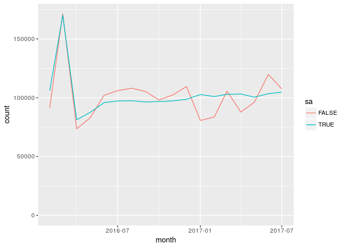

# UK property transactions counts -- July 2017 
KAI Data Exploitation cover version  

#Reproducing the plots
<!-- --><!-- --><!-- --><!-- --><!-- --><!-- --><!-- --><!-- -->

#Reproducing the tables
 Table 2
 

month        sa       England   Northern Ireland   Scotland       UK   Wales
-----------  ------  --------  -----------------  ---------  -------  ------
2016-02-01   FALSE      80110               1720       5670    91310    3810
2016-02-01   TRUE          NA                 NA         NA   105990      NA
2016-03-01   FALSE     149710               3310      11330   171370    7020
2016-03-01   TRUE          NA                 NA         NA   170230      NA
2016-04-01   FALSE      62150               1450       6760    73560    3200
2016-04-01   TRUE          NA                 NA         NA    81240      NA
2016-05-01   FALSE      70490               1650       7260    83000    3600
2016-05-01   TRUE          NA                 NA         NA    87560      NA
2016-06-01   FALSE      86860               2090       8860   102130    4320
2016-06-01   TRUE          NA                 NA         NA    95920      NA
2016-07-01   FALSE      90220               1980       9300   106040    4540
2016-07-01   TRUE          NA                 NA         NA    97220      NA
2016-08-01   FALSE      92650               2110       8640   108100    4700
2016-08-01   TRUE          NA                 NA         NA    97460      NA
2016-09-01   FALSE      89100               2220       9490   105370    4560
2016-09-01   TRUE          NA                 NA         NA    96420      NA
2016-10-01   FALSE      83250               1960       8440    98050    4400
2016-10-01   TRUE          NA                 NA         NA    96740      NA
2016-11-01   FALSE      86920               2190       8710   102430    4610
2016-11-01   TRUE          NA                 NA         NA    97300      NA
2016-12-01   FALSE      93540               2330       8560   109570    5140
2016-12-01   TRUE          NA                 NA         NA    98670      NA
2017-01-01   FALSE      69090               1720       6400    80680    3470
2017-01-01   TRUE          NA                 NA         NA   102720      NA
2017-02-01   FALSE      72360               1750       5860    83630    3660
2017-02-01   TRUE          NA                 NA         NA   101000      NA
2017-03-01   FALSE      88780               2130       9320   105550    5320
2017-03-01   TRUE          NA                 NA         NA   102940      NA
2017-04-01   FALSE      73900               1800       8030    87720    3990
2017-04-01   TRUE          NA                 NA         NA   102090      NA
2017-05-01   FALSE      82480               2120       8700    97830    4530
2017-05-01   TRUE          NA                 NA         NA   100270      NA
2017-06-01   FALSE      92910               2480      10340   110750    5020
2017-06-01   TRUE          NA                 NA         NA    96910      NA
