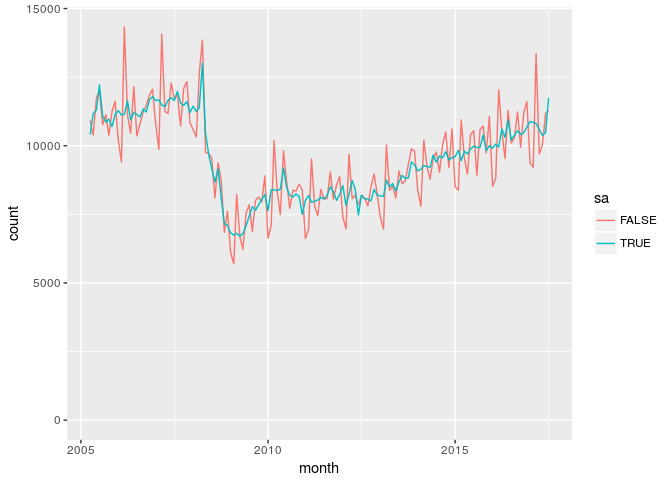

# UK property transactions counts -- July 2017 
KAI Data Exploitation cover version  

# Plots

<!--html_preserve-->

<!--/html_preserve-->

<!-- --><!-- --><!-- --><!-- --><!-- --><!-- --><!-- -->

#Reproducing the tables
 Table 2
 

month        sa       England   Northern Ireland   Scotland       UK   Wales
-----------  ------  --------  -----------------  ---------  -------  ------
2016-02-01   FALSE      80110               1720       5670    91310    3810
2016-02-01   TRUE          NA                 NA         NA   105990      NA
2016-03-01   FALSE     149710               3310      11330   171370    7020
2016-03-01   TRUE          NA                 NA         NA   170230      NA
2016-04-01   FALSE      62150               1450       6760    73560    3200
2016-04-01   TRUE          NA                 NA         NA    81240      NA
2016-05-01   FALSE      70490               1650       7260    83000    3600
2016-05-01   TRUE          NA                 NA         NA    87560      NA
2016-06-01   FALSE      86860               2090       8860   102130    4320
2016-06-01   TRUE          NA                 NA         NA    95920      NA
2016-07-01   FALSE      90220               1980       9300   106040    4540
2016-07-01   TRUE          NA                 NA         NA    97220      NA
2016-08-01   FALSE      92650               2110       8640   108100    4700
2016-08-01   TRUE          NA                 NA         NA    97460      NA
2016-09-01   FALSE      89100               2220       9490   105370    4560
2016-09-01   TRUE          NA                 NA         NA    96420      NA
2016-10-01   FALSE      83250               1960       8440    98050    4400
2016-10-01   TRUE          NA                 NA         NA    96740      NA
2016-11-01   FALSE      86920               2190       8710   102430    4610
2016-11-01   TRUE          NA                 NA         NA    97300      NA
2016-12-01   FALSE      93540               2330       8560   109570    5140
2016-12-01   TRUE          NA                 NA         NA    98670      NA
2017-01-01   FALSE      69090               1720       6400    80680    3470
2017-01-01   TRUE          NA                 NA         NA   102720      NA
2017-02-01   FALSE      72360               1750       5860    83630    3660
2017-02-01   TRUE          NA                 NA         NA   101000      NA
2017-03-01   FALSE      88780               2130       9320   105550    5320
2017-03-01   TRUE          NA                 NA         NA   102940      NA
2017-04-01   FALSE      73970               1800       8030    87780    3980
2017-04-01   TRUE          NA                 NA         NA   103200      NA
2017-05-01   FALSE      81150               2100       8550    96250    4450
2017-05-01   TRUE          NA                 NA         NA   100460      NA
2017-06-01   FALSE     100520               2710      11200   119820    5390
2017-06-01   TRUE          NA                 NA         NA   103450      NA
2017-07-01   FALSE      91900               2000       8820   107500    4780
2017-07-01   TRUE          NA                 NA         NA   104760      NA
